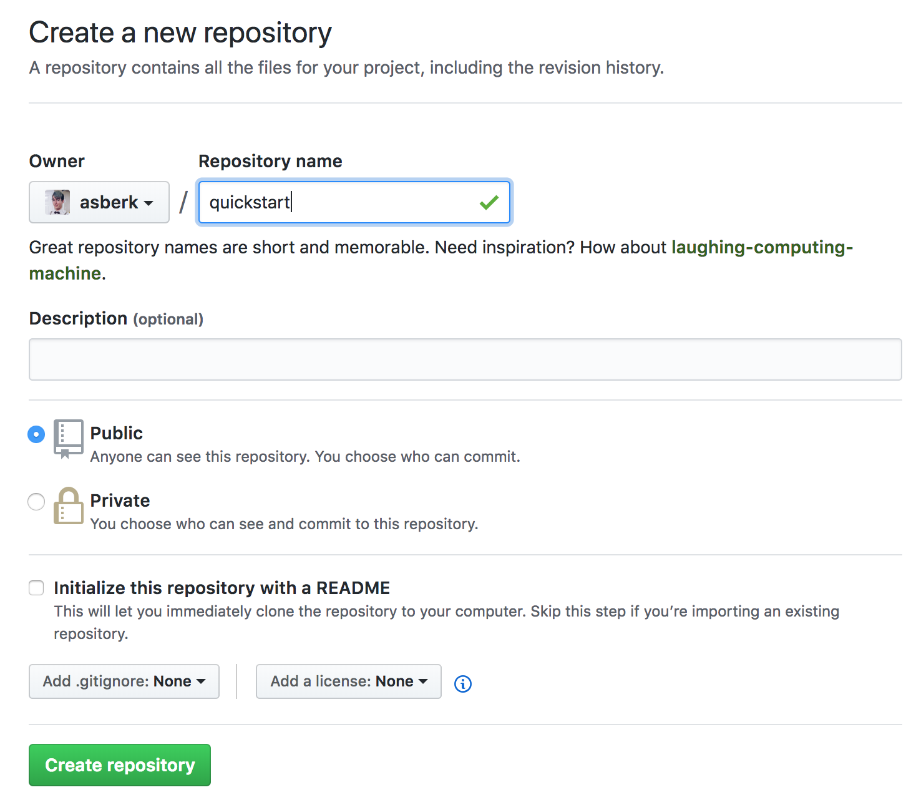
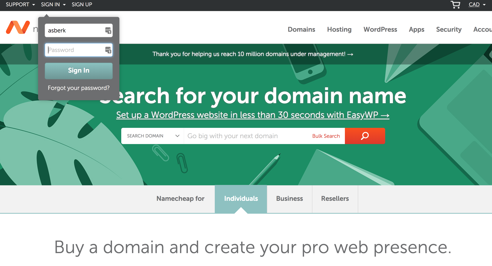
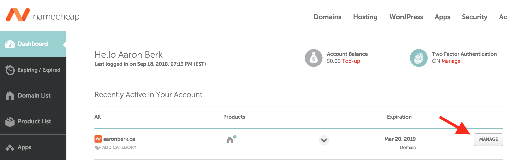
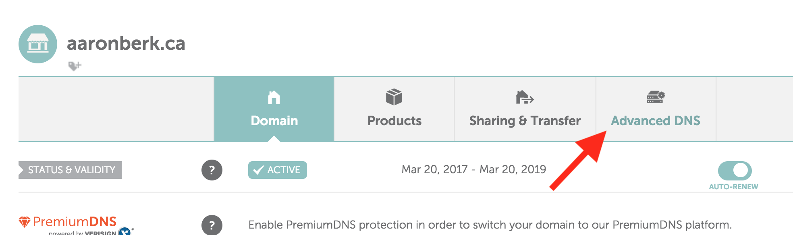
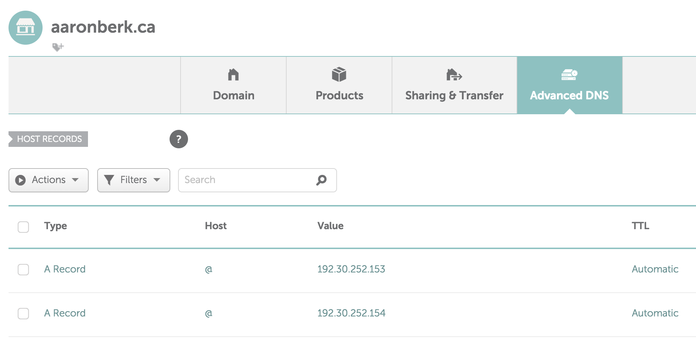
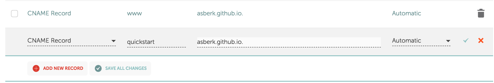
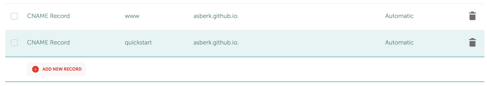
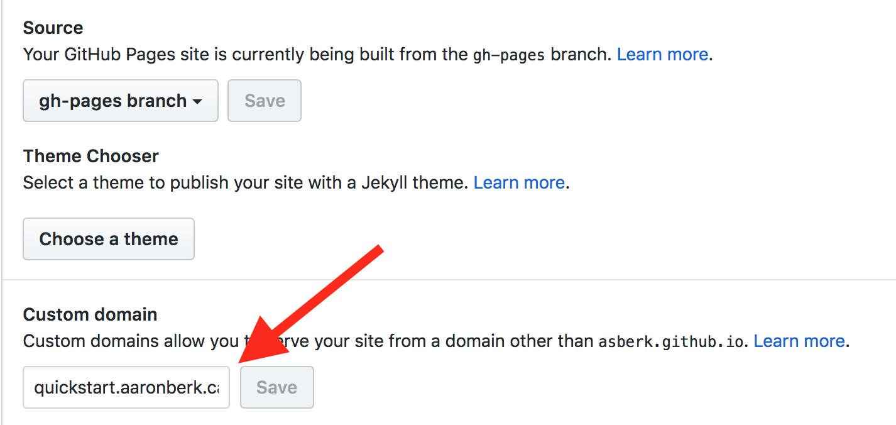

+++
title = "Host a website on GitHub with Hugo"
date = 2018-10-11T00:00:00-07:00
publishdate = 2018-10-06T00:00:00-07:00
draft = false

# Tags: can be used for filtering projects.
# Example: `tags = ["machine-learning", "deep-learning"]`
tags = ["website", "hugo", "github", "tutorial"]

# Project summary to display on homepage.
summary = "A tutorial on how to create, customize and host a website using Hugo and GitHub Pages."

# Optional image to display on homepage.
image_preview = "website-tutorial-thumb.png"

# Optional external URL for project (replaces project detail page).
external_link = ""

# Does the project detail page use math formatting?
math = false

# Does the project detail page use source code highlighting?
highlight = true

# Featured image
# Place your image in the `static/img/` folder and reference its filename below, e.g. `image = "example.jpg"`.
[header]
image = "website-tutorial-banner.jpg"
caption = "Images from [Pixabay.com](https://pixabay.com/)"

+++

16:00 &ndash; 17:00, Thursday 11 October 2018, LSK 121.

### Description

Learn how to get up and running with [Hugo](https://gohugo.io/), a popular
open-source static site generator that's fast and easy to use. Attendees can
follow a live coding session to learn how to generate and customize a brand new
Hugo website. We'll learn how to host the website from a GitHub repository using
GitHub Pages. Time and interest permitting, we'll explore how to host the site
on a custom domain (like [asberk.ca](http://asberk.ca)). This tutorial is the
perfect starting point for breaking away from the frumpy academic webpages of
yore, and attracting those shiny impressions that'll make your Google Analytics
page sing.

### Requirements

To be completed by attendees before the tutorial:

* [Install hugo](https://gohugo.io/getting-started/installing/) (e.g., using
  `brew install hugo`). If installed correctly, running `hugo version` in
  Terminal shouldn't return an error.
* Have a [GitHub account](https://github.com/) (it's free to sign up)
* Ensure [git is installed](https://git-scm.com/downloads). If installed
  correctly, running `git --version` in Terminal shouldn't return an error.
* (Optional) Have an account with a domain registrar (e.g. [Google
  Domains](https://domains.google/), [Namecheap](https://www.namecheap.com/),
  [CIRA](https://cira.ca/), etc.)


### Disclaimer

This tutorial claims absolutely no originality. It is merely a curation of the
four articles below, designed so that virtually anyone in attendance can get a
website up and running in one hour.

For more details than what's covered in the tutorial, Hugo offers a [Quickstart
Guide](https://gohugo.io/getting-started/quick-start/) and a post covering
[Basic Usage](https://gohugo.io/getting-started/usage/). In addition, there is
an article about [hosting on
GitHub](https://gohugo.io/hosting-and-deployment/hosting-on-github/) and about
[hosting on a custom
domain](https://gohugo.io/hosting-and-deployment/hosting-on-github/#use-a-custom-domain).

Notes for this presentation will be made available on this page after the
tutorial.


# Host a website on GitHub with Hugo

Tutorial assembled and hosted by [Aaron Berk](asberk.ca) from readily available resources (cited inline). 

### Resources

Hugo offers a [Quickstart
Guide](https://gohugo.io/getting-started/quick-start/). Here is [Basic
Usage](https://gohugo.io/getting-started/usage/).

Here is how to [host on
GitHub](https://gohugo.io/hosting-and-deployment/hosting-on-github/) (with a
blurb on [custom
domains](https://gohugo.io/hosting-and-deployment/hosting-on-github/#use-a-custom-domain)).

[GitHub documentation for custom
domain](https://help.github.com/articles/using-a-custom-domain-with-github-pages/).

Registrar options:

* [Gandi.net](https://www.gandi.net/en)
* [Internet.bs](https://internetbs.net)
* [Namecheap](https://www.namecheap.com/) 

### Steps

1. `brew install hugo`
2. Make sure hugo works by running `hugo version` in Terminal. 
3. Run `hugo new site quickstart` to create a new Hugo site in a folder named
   quickstart. e.g., I've created mine in `~/www/quickstart/`
4. Make sure you have a new repository for the site on GitHub
   
5. Get the example site into a repository
```bash
   cd quickstart
   git init
   git submodule add https://github.com/budparr/gohugo-theme-ananke.git themes/ananke
   git commit -m 'add theme submodule'
   rm config.toml
   cp -r themes/ananke/exampleSite/* ./
   # -> change theme name to theme folder name
   # -> remove themesDir variable
   # -> change baseURL to http://quickstart.aaronberk.ca
   emacs config.toml
   git add *
   git commit -m '[IC] example site'
   git remote add origin git@github.com:asberk/quickstart.git
   git push -u origin master
```
6. Now we need to get this thing [hosted on github pages](https://gohugo.io/hosting-and-deployment/hosting-on-github/#deployment-of-project-pages-from-your-gh-pages-branch).  
   ```bash
   # master must ignore gh-pages branch
   echo "public" >> .gitignore
   git add .gitignore
   git commit -m 'add .gitignore'
   git push
   # initialize gh-pages branch
   git checkout --orphan gh-pages
   git reset --hard
   git commit --allow-empty -m 'initializing gh-pages branch'
   git push origin gh-pages
   git checkout master
   # build and deploy using worktrees
   rm -rf public
   git worktree add -B gh-pages public origin/gh-pages
   # --> build site
   hugo
   cd public && git add --all && git commit -m 'publish to gh-pages' && cd ..
   git push origin gh-pages
   ```
   That's the coding bit. 
7. Finally, we need to go to GitHub and Namecheap to finagle with some things. First Namecheap...
   
   Once you have a site, click on **Manage**
   
   Then click on **Advanced DNS**
   
   GitHub requires that you enter these two IPs as **A Records**. 
   
   If you wish to use a custom URL like quickstart.aaronberk.ca then you must
   **enter a CNAME record** for it.
	
	
8. And next the settings on GitHub. First go into Settings. Scroll down to set
   the custom domain field to your site. Then click Save.
   
9. You should now be able to go to your shiny new website at
   `quickstart.aaronberk.ca`!
10. How do you make changes to your website? Here are some tips
    1. `hugo server` is your friend — let's you preview what's going on before
       you publish. Even refreshes every time you save changes.
    2. Useful shortcuts like `hugo new post/myNewPost.md`
    3. Look at the theme documentation for its full set of features — sometimes
       there are many!
    4. Use the `publish.sh` script [from the
       tutorial](https://gohugo.io/hosting-and-deployment/hosting-on-github/#put-it-into-a-script-1) (or a [slightly modified one](../../publish.txt)). The
       only caveat here is that this doesn't actually do the final `git push
       origin gh-pages` that you need, so you can add it in at the end to make
       sure it auto-pushes for you. Or don't, in case you don't want it to have
       that much power. :penguin:


